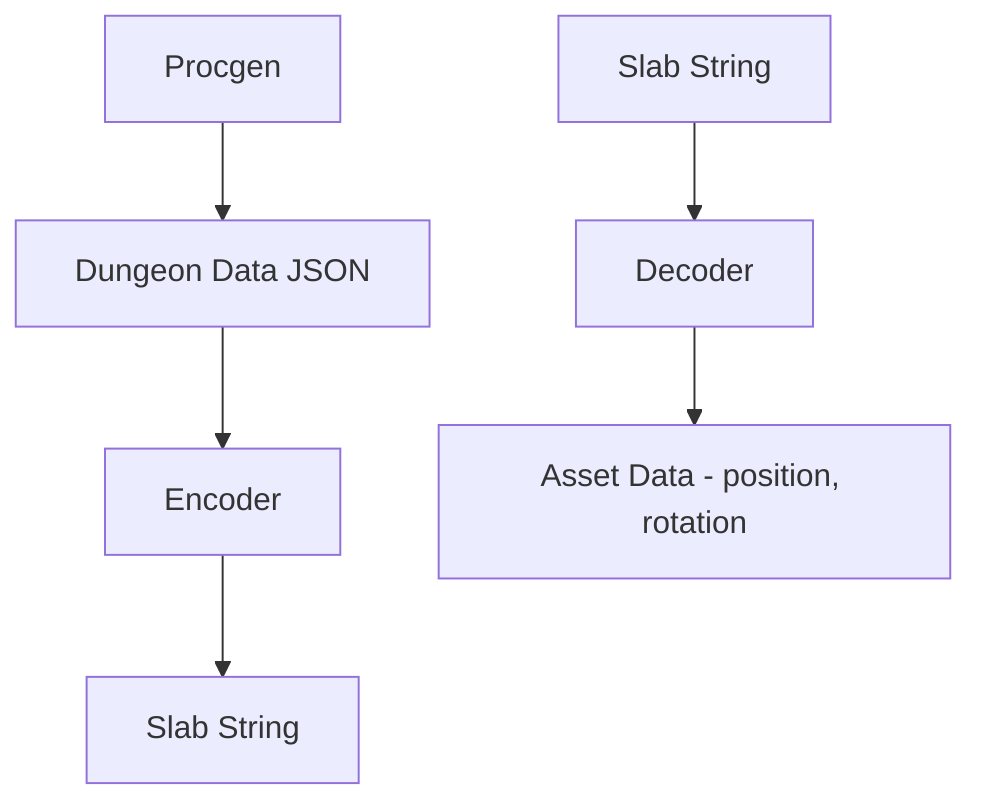

Processing Slab String
- optional triple back quotes (\`\`\`) at the beginning and end
- base64 encoded

Slab Format

HEADER:
(u32) = secret (always `0xD1CEFACE`)
(u16) = version (`2`)

COUNTS:
(u16) = layoutCount
(u16) = creatureCount (always 0)

LAYOUTS:
- each layout is 20 bytes
(uuid) AssetKindId
(u16) AssetCount
(u16) reserved

ASSETS:
- each Asset is 8 bytes (u64)
| 5 bits | 5 bits | 18 bits | 18 bits | 18 bits |
| unused |   rot  | scaledZ | scaledY | scaledX |